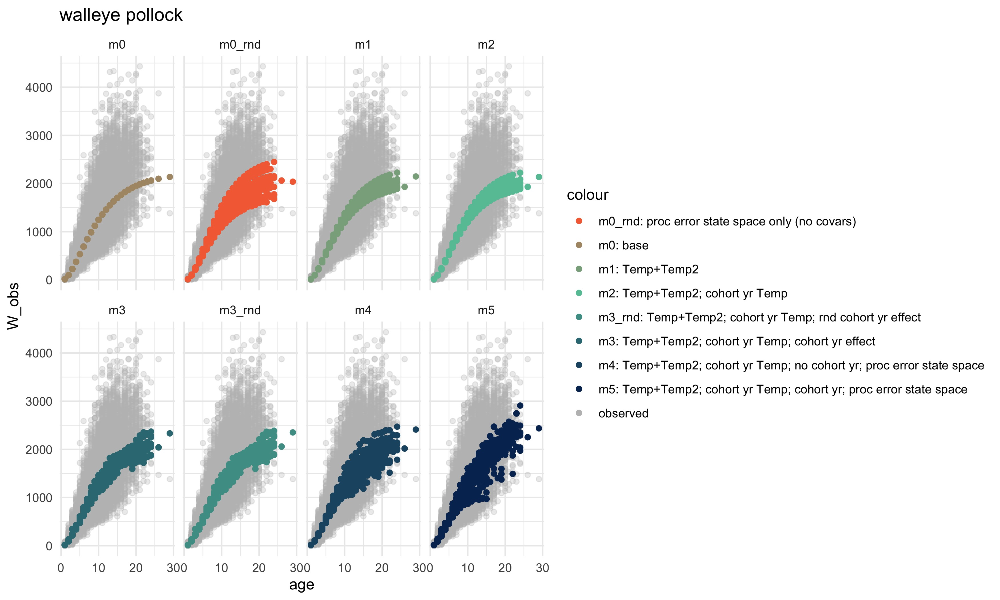
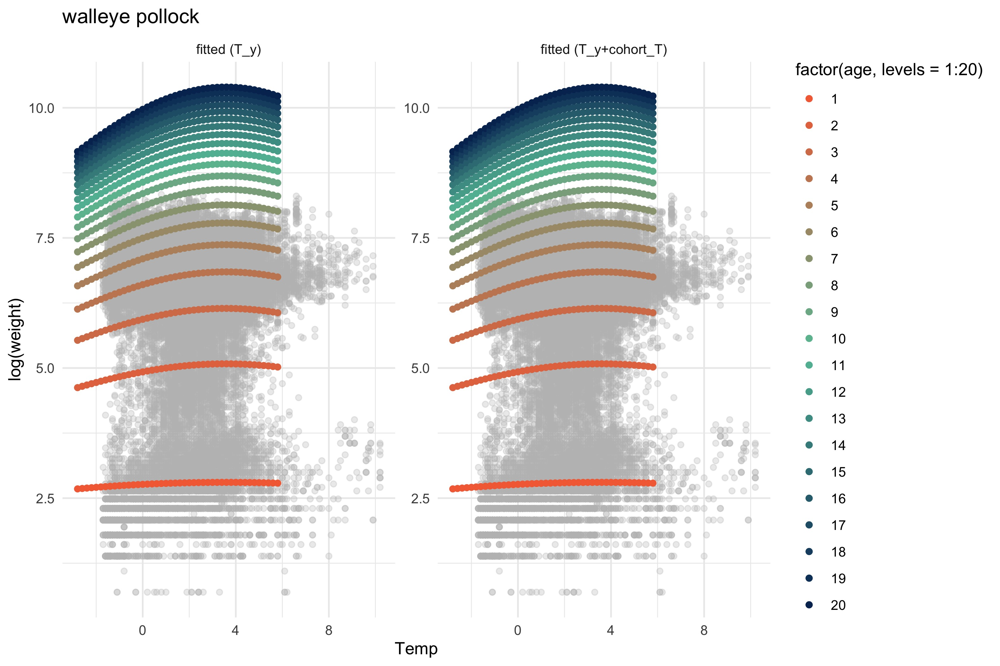

github repo: <https://github.com/kholsman/vonBEE>


Last updated: Oct 04, 2024

# Install the package vonBEE

``` r
  missing <- setdiff(c("devtools","usethis"),   installed.packages()[, 1])
  if (length(missing) > 0) 
    install.packages(missing)

  devtools::install_github("NOAA-REEM/vonBEE")
```

# Introduction

-   [ ] Add intro paragraph about climate effects on growth

Water temperature is known to directly impact growth through influencing
metabolic and digestion rates, which often scale exponentially with body
weight and temperature (see Hanson et al., 1997 for an overview).

(based on <https://seananderson.ca/2014/10/17/tmb/>)

# Methods

## Temperature specific weight at age

We modified the generalized formulation of the von Bertalanffy growth
function (VBGF; von Bertalanffy 1938; Pauly 1981; Temming 1994) to
predict temperature-dependent growth by allowing the allometric scaling
parameter *d* to increase with temperature. Essington et al. (2010) and
Holsman and Aydin (2015), and Holsman et al. (2016) describe the
derivation and application of the VBGF towards bioenergetics modeling in
great detail, so we do not repeat it here. Essentially, in this
formulation *d* represents the realized allometric slope of consumption,
which integrates both the direct effect of temperature on consumption
and indirect ecological interactions that scale with temperature and
influence relative foraging rates (see Essington et al., 2010; Holsman
and Aydin, 2015). We fit the VBGF to otolith-based length- and
weight-at-age data (*n* = 21,388, 14,362, and 772, for pollock, Pacific
cod, and arrowtooth flounder, respectively) collected during AFSC Bering
Sea surveys and analyzed at the AFSC (REF).

For each species, we used the vonBT() model to fit a state-space
environmental growth model for fish weight and age data using the base
state-space model (based on Gompertz et al. 20XX):

Eq. 1
$$ ln(\hat{W}{i}) = W^\infty{i} + \frac{1}{(1-d\_{i})}log(1-e^{-K(1-d\_{i})(A_i-t_0)})+\varepsilon_i\sim N(0,\sigma^2{obs})$$
, where

Eq. 2
$$W^\infty\_{i} =(\frac{H}{K})^{\frac{1}{(1 - d\_{i})}} $$

where *t*<sub>0, *i*</sub> is the age at which *W*<sub>*i*</sub> = 0,
*W*<sub>*i*</sub><sup>∞</sup> is the asymptotic mass which can vary by
individual *i* cohort year effects, *H* is the assimilation constant *K*
is the energy loss constant (Essington et al., 2010), and
*ε*<sub>*i*</sub> is a normally and independently distributed random
variable with mean 0 and variance *σ*<sub>*o**b**s*</sub><sup>2</sup>.
Essington et al. (2010) and Holsman and Aydin, (2015) statistically
estimated the *d*, *K* and *H* parameters for various species to
estimate consumption rates. In particular, Holsman and Aydin (2015)
found that the *d* parameter varied between species and regions in
Alaska (USA). We further modified this approach to estimate the
environment impacts growth on growth annually for each year *y* through
a logistic model that includes a vector of annual covariates
(*X*<sub>*c*, *y*</sub>) effects on *d* (which ranges between 0 and 1).
where *α*0<sub>*d*, *i*</sub> and *α*<sub>*d*, *i*, *y*</sub> represent
the mean the *d* consumption parameter intercept and *β*<sub>*c*</sub>
is the coefficient for the residual effect of an environmental variable
on the *d* consumption parameter, such that:

Eq. 3
*d*<sub>*i*</sub> = 1/(1+*e*<sup>−(*U*<sub>*y*</sub> + *β*<sub>0, *y*<sub>*y* − *A*<sub>*i*</sub></sub></sub> + ∑<sub>*c*</sub>(*β*<sub>*c*</sub>\**X*<sub>*c*, *y*</sub>)</sup>)

We chose this formulation based on the empirical relationship between
temperature and consumption, assuming that *d* would capture the
differential effects of temperature on growth, and that waste rates
scale proportionally with weight but do not vary over time with diet or
temperature (i.e. *K* is constant but *d* can vary with temperature).
This formulation allows both the slope and asymptotic limit of growth to
vary with temperature. Similar approaches, with slightly different
modifications to the VBGF, including temperature and prey specific terms
for *d* and *K*, respectively, have been used elsewhere to evaluate
climate impacts on fish growth (e.g., Cheung et al., 2015; Hamre, 2003).

We further modeled the *d* consumption parameter as a state-space model
that estimates random effects on *U*<sub>*y*</sub> as the unobserved
state vector:

Eq. 4
*U*<sub>*y*</sub> = *μ* + *β*<sub>1</sub>*U*<sub>*y* − 1</sub> + *ε*<sub>*y*</sub>
Process error is then modeled as a normal distribution with mean of 0
and standard deviation of *σ*<sub>*p**r**o**c*</sub>:

Eq. 5
*ε*<sub>*y*</sub> ∼ *N*(0,*σ*<sub>*p**r**o**c*</sub><sup>2</sup>)

Optionally, there can be auto regressive (state-space) terms included as
*β*<sub>1</sub> (e.g., if growth the previous year impacts growth in
observation year). Cohort year (*Y*<sub>*y* − *A*<sub>*i*</sub></sub> )
effects can also be included as random or fixed effects via
*β*<sub>0, *y*<sub>*y* − *A*<sub>*i*</sub></sub></sub>. If these terms
are not included the model simplifies to a random (process error) annual
intercept ( *μ*) plus covariate effects. If covariate terms are further
not included and the random process error is not estimated the model
simplifies to the generalized VonB.

Weight at age is then modeled as:

Eq. 6
*l**n*(*W*<sub>*i*</sub>) ∼ *N*(*l**n*(*Ŵ*<sub>*i*</sub>),*σ*<sub>*o**b**s*</sub><sup>2</sup>)
where *σ*<sub>*o**b**s*</sub> is the standard deviation of observation
error (log scale).

<!-- ###------- -->
<!-- Eq. 2 $~~~~~~W_{ij,y}=W_{\infty,iy} (1-e^{(-K_i (1-d_{i,y} )(j-t_{0,i} )) } )^{1/(1-d_{i,y} )} e^\varepsilon$, where $\varepsilon~N(0,\sigma_{d,i}^2 )$ -->
<!-- Eq. 3 $~~~~~~d_{i,y}=e^{(\alpha_{d,i,y}+\alpha0_{d,i}+\beta_{d,i}T_y) }$ -->

# Results

Comparative model fits using average observed bottom temperature are
included below.

-   [ ] Next add in G potential from energetic indices as a covariate.

## Eastern Bering Sea

### EBS pollock

<!--  -->
<!--  -->


<p class="caption">
Comparative model fits to observed weight at age data
</p>


<p class="caption">
Temperature effects on weight at age
</p>

| model  | top_set |   r2 |      nll |   k |     n | delta_aic | aic_wt | sum_aic_wt |
|:-------|:--------|-----:|---------:|----:|------:|----------:|-------:|-----------:|
| m5     | TRUE    | 0.80 | 14791.21 |  11 | 35617 |      0.00 |      1 |          1 |
| m2     | FALSE   | 0.77 | 16070.69 |   9 | 35617 |   2554.96 |      0 |          1 |
| m0     | FALSE   | 0.77 | 16206.30 |   5 | 35617 |   2818.16 |      0 |          1 |
| m1     | NA      | 0.77 | 16070.79 |   7 | 35617 |        NA |     NA |         NA |
| m3     | NA      | 0.78 | 15699.80 |  58 | 35617 |        NA |     NA |         NA |
| m3_rnd | NA      | 0.78 | 15891.81 |   9 | 35617 |        NA |     NA |         NA |
| m4     | NA      | 0.79 | 15400.81 |  11 | 35617 |        NA |     NA |         NA |

AIcc results for BS walleye pollock

### EBS Pacific cod


<p class="caption">
Comparative model fits to observed weight at age data
</p>


<p class="caption">
Temperature effects on weight at age
</p>

| model  | top_set |   r2 |      nll |   k |     n | delta_aic | aic_wt | sum_aic_wt |
|:-------|:--------|-----:|---------:|----:|------:|----------:|-------:|-----------:|
| m4     | TRUE    | 0.76 | 17174.24 |  11 | 28034 |      0.00 |      1 |          1 |
| m2     | FALSE   | 0.78 | 18463.98 |   9 | 28034 |   2575.48 |      0 |          1 |
| m1     | FALSE   | 0.77 | 18771.32 |   7 | 28034 |   3186.15 |      0 |          1 |
| m0     | FALSE   | 0.78 | 19240.30 |   5 | 28034 |   4120.12 |      0 |          1 |
| m3     | NA      | 0.78 | 16959.47 |  51 | 28034 |        NA |     NA |         NA |
| m3_rnd | NA      | 0.78 | 17010.33 |   9 | 28034 |        NA |     NA |         NA |
| m5     | NA      | 0.77 | 16491.97 |  11 | 28034 |        NA |     NA |         NA |

AIcc results for BS Pacific cod

### EBS arrowtooth flounder


<p class="caption">
Comparative model fits to observed weight at age data
</p>


<p class="caption">
Temperature effects on weight at age
</p>

| model  | top_set |   r2 |      nll |   k |    n | delta_aic | aic_wt | sum_aic_wt |
|:-------|:--------|-----:|---------:|----:|-----:|----------:|-------:|-----------:|
| m2     | TRUE    | 0.77 | 3153.059 |   9 | 6467 |      0.00 |      1 |          1 |
| m1     | FALSE   | 0.76 | 3218.419 |   7 | 6467 |    126.71 |      0 |          1 |
| m0     | FALSE   | 0.76 | 3344.602 |   5 | 6467 |    375.07 |      0 |          1 |
| m3     | NA      | 0.77 | 3039.064 |  46 | 6467 |        NA |     NA |         NA |
| m3_rnd | NA      | 0.77 | 3167.428 |   9 | 6467 |        NA |     NA |         NA |
| m4     | NA      | 0.76 | 3111.604 |  11 | 6467 |        NA |     NA |         NA |
| m5     | NA      | 0.77 | 3073.734 |  11 | 6467 |        NA |     NA |         NA |

AIcc results for BS arrowtooth flounder

### EBS sablefish

<!-- ```{r echo = FALSE, results = 'asis',message=F} -->
<!--  # 1] "arrowtooth flounder" "Pacific cod"         "sablefish"           -->
<!--   # [4] "walleye pollock"     "yellowfin sole"  -->
<!--   sp <- "sablefish" -->
<!--   fn <- file.path("data","out",reg,sp) -->
<!--   library(knitr) -->
<!--   library(dplyr) -->
<!-- ``` -->
<!-- ```{r echo=FALSE, fig.cap="Comparative model fits to observed weight at age data", out.width = '100%'} -->
<!-- knitr::include_graphics(file.path(fn,"Figs", "model_plots.jpg")) -->
<!-- ``` -->
<!-- ```{r echo=FALSE, fig.cap="Temperature effects on weight at age", out.width = '100%'} -->
<!-- knitr::include_graphics(file.path(fn,"Figs", "model_Temp_byage2.jpg")) -->
<!-- ``` -->
<!-- ```{r echo = FALSE, results = 'asis',message=F}   -->
<!--   aic_tab <- read.csv(file.path(fn, "aic_table.csv")) -->
<!--   aic_tab <- aic_tab%>%select(model,top_set,r2,nll, k, n,  aicc =, delta_aic,aic_wt, sum_aic_wt)%>%mutate(r2=round(r2,2), delta_aic=round(delta_aic,2)) -->
<!--   kable(aic_tab, caption = paste("AIcc results for ",reg,sp)) -->
<!--   rm(aic_tab) -->
<!--   rm(fn) -->
<!-- ``` -->

### EBS yellowfin sole


<p class="caption">
Comparative model fits to observed weight at age data
</p>


<p class="caption">
Temperature effects on weight at age
</p>

| model | top_set |   r2 |       nll |   k |             n | delta_aic | aic_wt | sum_aic_wt |
|:------|:-------|-----:|---------:|---:|------------:|---------:|------:|----------:|
| m4    | TRUE    | 0.76 |  8935.907 |  11 |    -0.8866068 |      0.00 |      1 |          1 |
| m2    | FALSE   | 0.76 |  9136.776 |   9 | 16739.0000000 |    418.24 |      0 |          1 |
| m1    | FALSE   | 0.76 |  9347.177 |   7 | 16739.0000000 |    835.03 |      0 |          1 |
| m0    | FALSE   | 0.76 |  9358.274 |   5 | 16739.0000000 |    853.22 |      0 |          1 |
| m3    | FALSE   | 0.69 | 13307.331 |  66 | 16739.0000000 |   8873.87 |      0 |          1 |

AIcc results for BS yellowfin sole

## Gulf of Alaska

### EBS pollock

<!--  -->
<!--  -->


<p class="caption">
Comparative model fits to observed weight at age data
</p>


<p class="caption">
Temperature effects on weight at age
</p>

| model  | top_set |   r2 |      nll |   k |             n | delta_aic | aic_wt | sum_aic_wt |
|:------|:-------|-----:|--------:|---:|------------:|---------:|------:|----------:|
| m4     | TRUE    | 0.84 | 5010.306 |  11 |    -0.9542845 |      0.00 |      1 |          1 |
| m5     | FALSE   | 0.84 | 5296.434 |  11 | 10722.0000000 |    592.66 |      0 |          1 |
| m2     | FALSE   | 0.81 | 5368.963 |   9 | 10722.0000000 |    733.71 |      0 |          1 |
| m3     | FALSE   | 0.83 | 5426.602 |  53 | 10722.0000000 |    937.51 |      0 |          1 |
| m1     | FALSE   | 0.81 | 5488.626 |   7 | 10722.0000000 |    969.03 |      0 |          1 |
| m3_rnd | FALSE   | 0.83 | 5576.810 |   9 | 10722.0000000 |   1149.40 |      0 |          1 |
| m0     | FALSE   | 0.79 | 5986.006 |   5 | 10722.0000000 |   1959.79 |      0 |          1 |

AIcc results for GOA walleye pollock

### EBS Pacific cod


<p class="caption">
Comparative model fits to observed weight at age data
</p>


<p class="caption">
Temperature effects on weight at age
</p>

| model  | top_set |   r2 |      nll |   k |            n | delta_aic | aic_wt | sum_aic_wt |
|:------|:-------|-----:|--------:|---:|------------:|---------:|------:|----------:|
| m5     | TRUE    | 0.75 | 3330.185 |  11 | 6475.0000000 |      0.00 |      1 |          1 |
| m3     | FALSE   | 0.74 | 3337.060 |  47 | 6475.0000000 |     86.41 |      0 |          1 |
| m3_rnd | FALSE   | 0.74 | 3458.854 |   9 | 6475.0000000 |    253.32 |      0 |          1 |
| m4     | FALSE   | 0.71 | 3492.425 |  11 |   -0.8834478 |    303.95 |      0 |          1 |
| m2     | FALSE   | 0.71 | 3789.645 |   9 | 6475.0000000 |    914.91 |      0 |          1 |
| m1     | FALSE   | 0.71 | 3825.098 |   7 | 6475.0000000 |    981.80 |      0 |          1 |
| m0     | FALSE   | 0.71 | 3933.990 |   5 | 6475.0000000 |   1195.58 |      0 |          1 |

AIcc results for GOA Pacific cod

### EBS arrowtooth flounder


<p class="caption">
Comparative model fits to observed weight at age data
</p>


<p class="caption">
Temperature effects on weight at age
</p>

| model | top_set |   r2 |      nll |   k |            n | delta_aic |    aic_wt | sum_aic_wt |
|:-----|:-------|-----:|--------:|---:|-----------:|---------:|---------:|----------:|
| m4    | TRUE    | 0.71 | 3452.232 |  11 |   -0.8167271 |      0.00 | 0.9993974 |     0.9994 |
| m3    | FALSE   | 0.73 | 3411.931 |  48 | 5716.0000000 |     14.83 | 0.0006026 |     1.0000 |
| m2    | FALSE   | 0.71 | 3482.078 |   9 | 5716.0000000 |     76.32 | 0.0000000 |     1.0000 |
| m1    | FALSE   | 0.71 | 3492.948 |   7 | 5716.0000000 |     94.05 | 0.0000000 |     1.0000 |
| m0    | FALSE   | 0.72 | 3505.724 |   5 | 5716.0000000 |    115.59 | 0.0000000 |     1.0000 |
| m5    | FALSE   | 0.73 | 3519.829 |  11 | 5716.0000000 |    155.84 | 0.0000000 |     1.0000 |

AIcc results for GOA arrowtooth flounder

### EBS sablefish

<!-- ```{r echo = FALSE, results = 'asis',message=F} -->
<!--  # 1] "arrowtooth flounder" "Pacific cod"         "sablefish"           -->
<!--   # [4] "walleye pollock"     "yellowfin sole"  -->
<!--   sp <- "sablefish" -->
<!--   fn <- file.path("data","out",reg,sp) -->
<!--   library(knitr) -->
<!--   library(dplyr) -->
<!-- ``` -->
<!-- ```{r echo=FALSE, fig.cap="Comparative model fits to observed weight at age data", out.width = '100%'} -->
<!-- knitr::include_graphics(file.path(fn,"Figs", "model_plots.jpg")) -->
<!-- ``` -->
<!-- ```{r echo=FALSE, fig.cap="Temperature effects on weight at age", out.width = '100%'} -->
<!-- knitr::include_graphics(file.path(fn,"Figs", "model_Temp_byage2.jpg")) -->
<!-- ``` -->
<!-- ```{r echo = FALSE, results = 'asis',message=F}   -->
<!--   aic_tab <- read.csv(file.path(fn, "aic_table.csv")) -->
<!--   aic_tab <- aic_tab%>%select(model,top_set,r2,nll, k, n,  aicc =, delta_aic,aic_wt, sum_aic_wt)%>%mutate(r2=round(r2,2), delta_aic=round(delta_aic,2)) -->
<!--   kable(aic_tab, caption = paste("AIcc results for ",reg,sp)) -->
<!--   rm(aic_tab) -->
<!--   rm(fn) -->
<!-- ``` -->

### EBS yellowfin sole

# other
