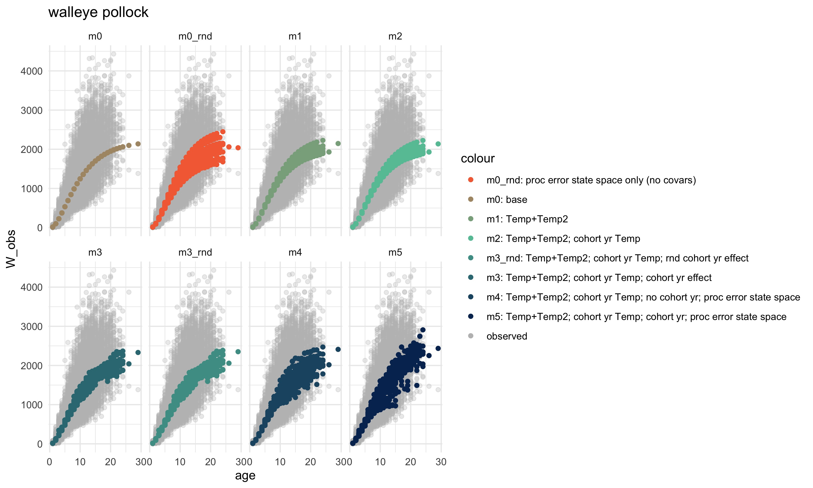
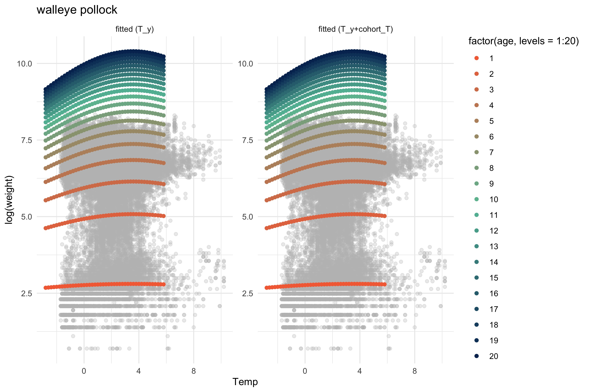

```{r startup, eval=TRUE, echo=FALSE, results='hide',message=FALSE}
 
 #source("R/make.R")       # loads packages, data, setup, etc.
 knitr::opts_chunk$set(echo = T, fig.align="center")
 thisYr <- format(Sys.time(), "%Y")
 today  <- format(Sys.time(), "%b %d, %Y")

# source("R/sub_scripts/KirVonB.R")
 
```

Last updated: `r today`

# Introduction

-   [ ] Add intro paragraph about climate effects on growth

Water temperature is known to directly impact growth through influencing metabolic and digestion rates, which often scale exponentially with body weight and temperature (see Hanson et al., 1997 for an overview).

(based on <https://seananderson.ca/2014/10/17/tmb/>)

# Methods

## Temperature specific weight at age

We modified the generalized formulation of the von Bertalanffy growth function (VBGF; von Bertalanffy 1938; Pauly 1981; Temming 1994) to predict temperature-dependent growth by allowing the allometric scaling parameter $d$ to increase with temperature. Essington et al. (2010) and Holsman and Aydin (2015), and Holsman et al. (2016) describe the derivation and application of the VBGF towards bioenergetics modeling in great detail, so we do not repeat it here. Essentially, in this formulation $d$ represents the realized allometric slope of consumption, which integrates both the direct effect of temperature on consumption and indirect ecological interactions that scale with temperature and influence relative foraging rates (see Essington et al., 2010; Holsman and Aydin, 2015). We fit the VBGF to otolith-based length- and weight-at-age data ($n$ = 21,388, 14,362, and 772, for pollock, Pacific cod, and arrowtooth flounder, respectively) collected during AFSC Bering Sea surveys and analyzed at the AFSC (REF).

For each species, we used the vonBT() model to fit a state-space environmental growth model for fish weight and age data using the base state-space model (based on Gompertz et al. 20XX):

Eq. 1 $$ ln(\hat{W}{i}) = W^\infty{i} + \frac{1}{(1-d_{i})}log(1-e^{-K(1-d_{i})(A_i-t_0)})+\varepsilon_i\sim N(0,\sigma^2{obs})$$ , where

Eq. 2 $$W^\infty_{i} =(\frac{H}{K})^{\frac{1}{(1 - d_{i})}} $$

where $t_{0,i}$ is the age at which $W_{i} = 0$, $W^{\infty}_{i}$ is the asymptotic mass which can vary by individual $i$ cohort year effects, $H$ is the assimilation constant $K$ is the energy loss constant (Essington et al., 2010), and $\varepsilon_i$ is a normally and independently distributed random variable with mean 0 and variance $\sigma_{obs}^2$. Essington et al. (2010) and Holsman and Aydin, (2015) statistically estimated the $d$, $K$ and $H$ parameters for various species to estimate consumption rates. In particular, Holsman and Aydin (2015) found that the $d$ parameter varied between species and regions in Alaska (USA). We further modified this approach to estimate the environment impacts growth on growth annually for each year $y$ through a logistic model that includes a vector of annual covariates ($X_{c,y}$) effects on $d$ (which ranges between 0 and 1). where $\alpha0_{d,i}$ and $\alpha_{d,i,y}$ represent the mean the $d$ consumption parameter intercept and $\\beta_{c}$ is the coefficient for the residual effect of an environmental variable on the $d$ consumption parameter, such that:

Eq. 3 $$d_{i} = 1/(1+e^{-(U_{y}+\beta_{0,y_{y-A_i}}+\sum_c(\beta_{c}*X_{c,y})}) $$

We chose this formulation based on the empirical relationship between temperature and consumption, assuming that $d$ would capture the differential effects of temperature on growth, and that waste rates scale proportionally with weight but do not vary over time with diet or temperature (i.e. $K$ is constant but $d$ can vary with temperature). This formulation allows both the slope and asymptotic limit of growth to vary with temperature. Similar approaches, with slightly different modifications to the VBGF, including temperature and prey specific terms for $d$ and $K$, respectively, have been used elsewhere to evaluate climate impacts on fish growth (e.g., Cheung et al., 2015; Hamre, 2003).

We further modeled the $d$ consumption parameter as a state-space model that estimates random effects on $U_{y}$ as the unobserved state vector:

Eq. 4 $$ U_{y} = \mu+ \beta_{1}U_{y-1}+\varepsilon_y $$ Process error is then modeled as a normal distribution with mean of 0 and standard deviation of $\sigma_{proc}$:

Eq. 5 $$ \varepsilon_{y} \sim N(0,\sigma^2_{proc})$$

Optionally, there can be auto regressive (state-space) terms included as $\beta_1$ (e.g., if growth the previous year impacts growth in observation year). Cohort year ($Y_{y-A_i}$ ) effects can also be included as random or fixed effects via $\beta_{0,y_{y-A_i}}$. If these terms are not included the model simplifies to a random (process error) annual intercept ( $\mu$) plus covariate effects. If covariate terms are further not included and the random process error is not estimated the model simplifies to the generalized VonB.

Weight at age is then modeled as:

Eq. 6 $$ ln({W}_i) \sim N(ln(\hat{W}_i),\sigma^2_{obs})$$ where $\sigma_{obs}$ is the standard deviation of observation error (log scale).

<!-- ###------- -->

<!-- Eq. 2 $~~~~~~W_{ij,y}=W_{\infty,iy} (1-e^{(-K_i (1-d_{i,y} )(j-t_{0,i} )) } )^{1/(1-d_{i,y} )} e^\varepsilon$, where $\varepsilon~N(0,\sigma_{d,i}^2 )$ -->

<!-- Eq. 3 $~~~~~~d_{i,y}=e^{(\alpha_{d,i,y}+\alpha0_{d,i}+\beta_{d,i}T_y) }$ -->

# Results

Comparative model fits using average observed bottom temperature are included below.

-   [ ] Next add in G potential from energetic indices as a covariate.



<!-- <!-- {width="400"} --> -->


```{r makeReadME, echo=FALSE,eval=F, include =F}

# source("R/make.R")
 # copy and paste this into R window (won't work within markdown)

 rmd2md(rmd_fl = "vonBT_intro",md_fl = "README")


```


